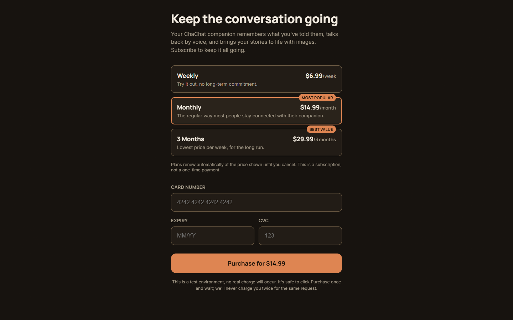

# ChaChat Funnel

[Русский](README.md) · **English**

[Русский](README.md) · **English**

A full-stack test assignment: a small acquisition funnel for ChaChat, an AI
companion/roleplay chat app. The focus is correctness of the user scenario,
identity handling, attribution, analytics, and payment logic (including
concurrent and repeated requests), not visual polish.

```
Start → Quiz → Email → Paywall → Payment → Install
```

Payment isn't a separate route. It's the processing state of the Paywall's
purchase request, handled by a deterministic fake payment processor.



## Tech stack

- Next.js 16 (App Router) + React 19, UI and API routes in one app
- TypeScript throughout
- PostgreSQL 16, the single source of truth for identity, funnel events, quiz
  answers, plans, payment attempts, and purchases
- Prisma 6 for schema, migrations, and the DB client
- Docker Compose (`postgres:16-alpine` plus the app, built from the repo
  [Dockerfile](Dockerfile))
- Vitest, run against a real Postgres instance, no DB mocking

If a library isn't in [package.json](package.json), it isn't part of this
project.

## Quick start

```bash
cp .env.example .env
docker compose up
```

This starts two services: `db` (Postgres, with a healthcheck gating the
app's startup) and `app` (the Next.js app). On every container start, the
entrypoint runs `prisma migrate deploy`, then `node prisma/seed.mjs`, then
`npm run start`. Migrations apply automatically and the three-plan catalog
(weekly / monthly / 3-months) is seeded automatically, so no manual database
setup is needed. The seed script upserts by plan slug, so it's also a
no-op on later restarts.

The app runs at **http://localhost:3000**.

To check the app can reach the database:

```bash
curl http://localhost:3000/api/health
# {"status":"ok","database":"connected"}
```

## Tests

```bash
docker compose up -d db   # tests run against a real Postgres, not a mock
npm install
npm test                  # vitest run
```

[tests/](tests/) covers identity/session resolution and attribution, the
quiz, the fake PSP, the Paywall, and, most heavily, the payment state
machine, retries, and concurrency (double-click, two tabs, repeated
request). Testing effort was concentrated on payment logic and the
invariants behind it; most UI components and simpler API routes aren't
unit-tested directly.

Other checks:

```bash
npm run typecheck
npm run lint
npm run build
```

## Test payment cards

The payment processor is a deterministic fake PSP
([lib/fake-psp.ts](lib/fake-psp.ts)). No network call is ever made, and the
outcome depends only on the card number entered in the Paywall's payment
form. These aren't real payment credentials; they only work against this
project's fake processor.

| Card number            | Outcome | Notes                                                       |
| ----------------------- | ------- | ------------------------------------------------------------ |
| `4242 4242 4242 4242`   | Success | Resolves immediately.                                        |
| `4000 0000 0000 0002`   | Decline | Resolves immediately, reason `card_declined`.                 |
| `4000 0000 0000 0044`   | Timeout | Resolves as `timed_out` after a bounded ~3s simulated delay. |

Any other card number, including malformed input, is declined with reason
`unsupported_test_card`. Expiry/CVC are accepted but never affect the
outcome, only the client-side format check in [lib/card.ts](lib/card.ts)
has to pass: any not-yet-expired `MM/YY` (e.g. `12/30`), and any 3-4 digit
CVC (e.g. `123`). Full details: [docs/fake-psp.md](docs/fake-psp.md).

## Funnel behavior

- **Start**: value proposition, single CTA into the quiz. An anonymous
  visitor and session are established here (or on first request) and
  persist across the funnel, before any identity is known.
- **Quiz**: five questions, one answer saved per step. Re-answering a step
  updates the existing answer instead of duplicating it.
- **Email**: identifies the visitor as a user. A new email creates a user;
  an existing email links the current visitor to that user without losing
  quiz/attribution history and without creating a duplicate user.
- **Paywall**: three DB-backed subscription plans plus a custom payment
  form, no external redirect.
- **Payment**: the Paywall form's purchase request goes through the fake
  PSP. The UI reflects success, decline, or timeout, and offers retry on
  failure.
- **Install**: shown only once the identity has a succeeded purchase,
  checked server-side on every visit. Links to real public ChaChat entry
  points.
- **Repeat visit**: a returning visitor whose identity already has a
  succeeded purchase is redirected straight to Install regardless of which
  funnel screen they land on (Start, any Quiz step, Email, or Paywall), and
  Install re-checks access on every load.

Full rationale for these decisions, including the identity model,
attribution, the payment state machine, and concurrency handling, is in
[docs/spec.md](docs/spec.md).

## Analytics

Funnel events are written to the `funnel_events` table as they happen, not
just logged client-side. Every event carries `session_id`, a nullable
`user_id` (set once the visitor is identified), `event_name`,
`occurred_at`, and an event-specific `properties` payload.

Events implemented: `screen_view` (per screen, quiz views also carry the
step), `quiz_answer_submitted`, `quiz_completed`, `email_submitted` (new vs.
existing user), `plan_selected`, `purchase_attempted`,
`purchase_succeeded`, `purchase_failed` (with reason), `install_viewed`.

Six example queries live in
[docs/analytics-queries.sql](docs/analytics-queries.sql): Paywall
conversion, quiz drop-off, full funnel progression, plan popularity and
revenue, payment outcome distribution, and acquisition performance by UTM
source. All six were run against this schema and verified to return valid
results. Run the whole file against the running Postgres container:

```bash
docker compose exec -T db psql -U chachat -d chachat_funnel < docs/analytics-queries.sql
```

(The `db` container only sees its own filesystem, so the file has to be
piped in over stdin rather than referenced with `-f`.)

## Project structure

```
app/            Next.js App Router: pages (start/quiz/email/paywall/install)
                and API routes (app/api/*): session, identify, quiz answers,
                plan selection, purchase, health check
components/     Screen-level React components (one subfolder per screen) and
                shared client-side helpers (session bootstrap, screen-view firing)
lib/            Server-side business logic: db client, visitor/session
                resolution, identity linking, attribution, quiz, paywall,
                payment state machine + fake PSP, install guard, analytics
prisma/         schema.prisma, migrations/ (including raw-SQL invariants:
                case-insensitive email uniqueness, visitor.user_id
                immutability trigger, payment state-transition trigger,
                append-only funnel_events trigger), seed.mjs (plan catalog)
tests/          Vitest suites, run against a real Postgres (see "Tests")
docs/           spec.md (source of truth for behavior), product-research.md,
                fake-psp.md, analytics-queries.sql
```
